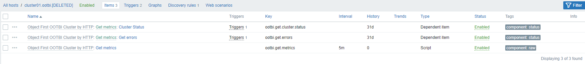
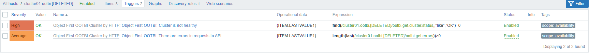
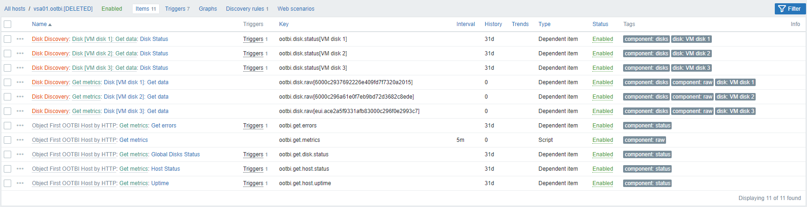
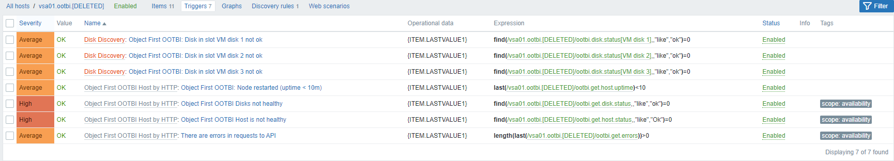
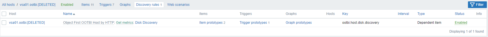

# Object First OOTBI Cluster by HTTP

<!--ts-->
* [Object First OOTBI Cluster by HTTP](#object-first-ootbi-cluster-by-http)
  * [Overview](#overview)
  * [Requirements](#requirements)
  * [Tested versions](#tested-versions)
  * [Setup](#setup)
  * [Template: Object First OOTBI Cluster by HTTP](#template-object-first-ootbi-cluster-by-http)
    * [Screenshots for Object First OOTBI Cluster by HTTP](#screenshots-for-object-first-ootbi-cluster-by-http)
    * [Macros for Object First OOTBI Cluster by HTTP](#macros-for-object-first-ootbi-cluster-by-http)
    * [Items for Object First OOTBI Cluster by HTTP](#items-for-object-first-ootbi-cluster-by-http)
    * [Triggers for Object First OOTBI Cluster by HTTP](#triggers-for-object-first-ootbi-cluster-by-http)
    * [LLD rule Node discovery](#lld-rule-node-discovery)
    * [Host Prototypes for Node discovery](#host-prototypes-for-node-discovery)
  * [Template: Object First OOTBI Host by HTTP](#template-object-first-ootbi-host-by-http)
    * [Screenshots for Object First OOTBI Host by HTTP](#screenshots-for-object-first-ootbi-host-by-http)
    * [Macros for Object First OOTBI Host by HTTP](#macros-for-object-first-ootbi-host-by-http)
    * [Items for Object First OOTBI Host by HTTP](#items-for-object-first-ootbi-host-by-http)
    * [Triggers for Object First OOTBI Host by HTTP](#triggers-for-object-first-ootbi-host-by-http)
    * [LLD rule Disk Discovery](#lld-rule-disk-discovery)
    * [Item prototypes for Disk Discovery](#item-prototypes-for-disk-discovery)
    * [Trigger prototypes for Disk Discovery](#trigger-prototypes-for-disk-discovery)
  * [Feedback](#feedback)
<!--te-->

## 📗 Documentation

This template is designed to monitor an Object First OOTBI Cluster.

## Requirements

Zabbix version: 7.0 and higher.

## Tested versions

This template has been tested on Object First OOTBI 1.5.54.10104 (VSA).

## Setup

1. Download the latest [release](https://github.com/ObjectFirstCommunity/objectfirstcommunity-zabbix/releases/latest)
1. Create a user to monitor the service or use an existing user.
1. Create a host with the name of your cluster and link the `Object First OOTBI Cluster by HTTP` template to it.
1. Configure the following macros: {$OOTBI.API.URL}, {$OOTBI.CLUSTER.ID}, {$OOTBI.USER}, and {$OOTBI.PASSWORD} ([details](#macros-for-object-first-ootbi-cluster-by-http))

## Template: Object First OOTBI Cluster by HTTP

This template is designed to monitor an Object First OOTBI Cluster.

### Screenshots for Object First OOTBI Cluster by HTTP

### Macros for Object First OOTBI Cluster by HTTP

|Name|Description|Default|
|----|-----------|-------|
|{$OOTBI.API.URL}|The OOTBI Cluster endpoint is a URL or IP in the format `<scheme>://<host>:<port>`. This needs to be the pointing to the Service Point of your OOTBI Cluster|`https://localhost:8443`|
|{$OOTBI.CLUSTER.ID}|The OOTBI Cluster ID (UUID). The Cluster UUID can be found in Settings. Optional, defaults to first cluster.||
|{$OOTBI.HTTP.PROXY}|Sets the HTTP proxy to `http_proxy` value. If this parameter is empty, then no proxy is used.||
|{$OOTBI.PASSWORD}|The `password` of the Object First OOTBI Cluster account. It is used to obtain an access token.||
|{$OOTBI.USER}|The `username` of the Object First OOTBI Cluster account. It is used to obtain an access token.||
|{$OOTBI.DATA.TIMEOUT}|A response timeout for the API.|`10`|

### Items for Object First OOTBI Cluster by HTTP

|Name|Description|Type|Key and additional info|
|----|-----------|----|-----------------------|
|Cluster Status|Get the cluster status|Dependent item|ootbi.get.cluster.status **Preprocessing**<ul><li>JSON Path: `$.cluster.status`</li><li>Discard unchanged with heartbeat: `1h`</li></ul>|
|Get errors|The errors from API requests.|Dependent item|ootbi.get.errors **Preprocessing**<ul><li>JSON Path: `$.error`⛔️Custom on fail: Set value to</li><li>Discard unchanged with heartbeat: `1h`</li></ul>|
|Get metrics|The result of API requests is expressed in the JSON.|Script|ootbi.get.metrics|

### Triggers for Object First OOTBI Cluster by HTTP

|Name|Description|Expression|Severity|Dependencies and additional info|
|----|-----------|----------|--------|--------------------------------|
|Object First OOTBI: Cluster status critical|
Cluster reports its status is critical. Please inspect the cluster.
|`find(/Object First OOTBI Cluster by HTTP/ootbi.get.cluster.status,,"like","CRITICAL")=1`|High||
|Object First OOTBI: Cluster status warning|
Cluster reports its status is warning. Please inspect the cluster.
|`find(/Object First OOTBI Cluster by HTTP/ootbi.get.cluster.status,,"like","WARNING")=1`|Average||
|Object First OOTBI: There are errors in requests to API|
Zabbix has received errors in response to API requests.
|`length(last(/Object First OOTBI Cluster by HTTP/ootbi.get.errors))>0`|Average||

### LLD rule Node discovery

|Name|Description|Type|Key and additional info|
|----|-----------|----|-----------------------|
|Node discovery|
Discovery of cluster nodes.
|Dependent item|ootbi.node.discovery
**Preprocessing**
<ul><li>
JSON Path: `$.cluster.nodes[:]`
</li><li>
Discard unchanged with heartbeat: `6h`
</li></ul>|

### Host Prototypes for Node discovery

|Name|Templates|Host Groups|Macros|
|----|---------|-----------|------|
|`{#NAME}`|[Object First OOTBI Host by HTTP](#template-object-first-ootbi-host-by-http)|Object First|<ul><li>`{$OOTBI.HOST.ID}`</li><li>{#ID}</li><li>The OOTBI Host ID. This is discovered automatically</li></ul>|

## Template: Object First OOTBI Host by HTTP

This template is designed to monitor an Object First OOTBI Host and will automatically be attached to hosts discovered from your cluster.

### Screenshots for Object First OOTBI Host by HTTP

### Macros for Object First OOTBI Host by HTTP

|Name|Description|Default|
|----|-----------|-------|
|{$OOTBI.API.URL}|The OOTBI Cluster endpoint is a URL or IP in the format `<scheme>://<host>:<port>`. This needs to be the pointing to the Service Point of your OOTBI Cluster|Inherited from Object First OOTBI Cluster by HTTP, customizable|
|{$OOTBI.CLUSTER.ID}|The OOTBI Cluster ID (UUID). The Cluster UUID can be found in Settings. Optional, defaults to first cluster.|Inherited from Object First OOTBI Cluster by HTTP, customizable|
|{$OOTBI.HTTP.PROXY}|Sets the HTTP proxy to `http_proxy` value. If this parameter is empty, then no proxy is used.|Inherited from Object First OOTBI Cluster by HTTP, customizable|
|{$OOTBI.PASSWORD}|The `password` of the Object First OOTBI Cluster account. It is used to obtain an access token.|Inherited from Object First OOTBI Cluster by HTTP, customizable|
|{$OOTBI.USER}|The `username` of the Object First OOTBI Cluster account. It is used to obtain an access token.|Inherited from Object First OOTBI Cluster by HTTP, customizable|
|{$OOTBI.DATA.TIMEOUT}|A response timeout for the API.|Inherited from Object First OOTBI Cluster by HTTP, customizable|
|{$OOTBI.HOST.ID}|The OOTBI Host ID. This is discovered automatically|Set by Object First OOTBI Cluster by HTTP, customizable|

### Items for Object First OOTBI Host by HTTP

|Name|Description|Type|Key and additional info|
|----|-----------|----|-----------------------|
|Get errors|The errors from API requests.|Dependent item|ootbi.get.errors **Preprocessing**<ul><li>JSON Path: `$.error`⛔️Custom on fail: Set value to</li><li>Discard unchanged with heartbeat: `1h`</li></ul>|
|Get metrics|The result of API requests is expressed in the JSON.|Script|ootbi.get.metrics|
|Global Disks Status|Get the global disk status|Dependent item|ootbi.get.disk.status **Preprocessing**<ul><li>JSON Path: `$.disks.status`</li><li>Discard unchanged with heartbeat: `1h`</li></ul>|
|Host Status|Get the host status.|Dependent item|ootbi.get.host.status **Preprocessing**<ul><li>JSON Path: `$.hosts.members.[?(@.id=='{$OOTBI.HOST.ID}')].status.first()`</li><li>Discard unchanged with heartbeat: `1h`</li></ul>|
|Uptime|The uptime of the node.|Dependent item|ootbi.get.host.uptime **Preprocessing**<ul><li>JSON Path: `$.hosts.members.[?(@.id=='{$OOTBI.HOST.ID}')].uptimeInSec.first()`</li></ul>|

### Triggers for Object First OOTBI Host by HTTP

|Name|Description|Expression|Severity|Dependencies and additional info|
|----|-----------|----------|--------|--------------------------------|
|Object First OOTBI: Disks status critical|
The cluster reports that the host has disks that are in a critical state. Please inspect the host.
|`find(/Object First OOTBI Host by HTTP/ootbi.get.disk.status,,"like","critical")=1`|High||
|Object First OOTBI: Disks status warning|
The cluster reports that the host has disks that are warning. Please inspect the host.
|`find(/Object First OOTBI Host by HTTP/ootbi.get.disk.status,,"like","warning")=1`|Average||
|Object First OOTBI: Host status is critical|
The cluster reports that the host status is critical. Please inspect the host.
|`find(/Object First OOTBI Host by HTTP/ootbi.get.host.status,,"like","Critical")=1`|High||
|Object First OOTBI: Host status is offline|
The cluster reports that the host status is offline. Please inspect the host.
|`find(/Object First OOTBI Host by HTTP/ootbi.get.host.status,,"like","Offline")=1`|Disaster||
|Object First OOTBI: Host status is unknown|
The cluster reports that the host status is unknown. Please inspect the host.
|`find(/Object First OOTBI Host by HTTP/ootbi.get.host.status,,"like","Unknown")=1`|Warning||
|Object First OOTBI: Host status is warning|
The cluster reports that the host status is warning. Please inspect the host.
|`find(/Object First OOTBI Host by HTTP/ootbi.get.host.status,,"like","Warning")=1`|Average||
|Object First OOTBI: Node restarted (uptime < 10m)|
The cluster node's uptime is less than 10 minutes.
|`last(/Object First OOTBI Host by HTTP/ootbi.get.host.uptime)<10`|Average||
|Object First OOTBI: There are errors in requests to API|
Zabbix has received errors in response to API requests.
|`length(last(/Object First OOTBI Host by HTTP/ootbi.get.errors))>0`|Average||

### LLD rule Disk Discovery

|Name|Description|Type|Key and additional info|
|----|-----------|----|-----------------------|
|Disk Discovery|
Discovery of node disks.
|Dependent item|ootbi.host.disk.discovery
**Preprocessing**
<ul><li>
JSON Path: `$.disks.disks`
</li><li>
Discard unchanged with heartbeat: `6h`
</li></ul>|

### Item prototypes for Disk Discovery

|Name|Description|Type|Key and additional info|
|----|-----------|----|-----------------------|
|Disk [{#SLOT}]: Get data|
Gets raw data from the disk in slot `[{#SLOT}]`.
|Dependent item|ootbi.disk.raw[{#ID}]
**Preprocessing**
<ul><li>
JSON Path: `$.disks.disks.[?(@.id=='{#ID}')].first()`
</li></ul>|
|Disk Status|
The status of the disk.
|Dependent item|ootbi.disk.status[{#SLOT}]
**Preprocessing**
<ul><li>
JSON Path: `$.status`
</li></ul>|

### Trigger prototypes for Disk Discovery

|Name|Description|Expression|Severity|Dependencies and additional info|
|----|-----------|----------|--------|--------------------------------|
|Object First OOTBI: Disk in slot {#SLOT} status critical|
The Disk in `{#SLOT}` has a critical status. Please check the disk in bay `{#BAY}`. Please download the support bundle and contact Object First Support.
|`find(/Object First OOTBI Host by HTTP/ootbi.disk.status[{#SLOT}],,"like","critical")=1`|High|**Manual close**: Yes|
|Object First OOTBI: Disk in slot {#SLOT} status warning|
The Disk in `{#SLOT}` has a warning status. Please check the disk in bay `{#BAY}`. Please download the support bundle and contact Object First Support.
|`find(/Object First OOTBI Host by HTTP/ootbi.disk.status[{#SLOT}],,"like","warning")=1`|Average|**Manual close**: Yes|

## Feedback

## ✍ Contributions

We welcome contributions from the community! We encourage you to create [issues](https://github.com/ObjectFirstCommunity/objectfirstcommunity-zabbix/issues/new/choose) for Bugs & Feature Requests and submit Pull Requests. For more detailed information, refer to our [Contributing Guide](CONTRIBUTING.md).

## 🤝🏾 License

* [MIT License](LICENSE)

## 🤔 Questions

If you have any questions or something is unclear, please don't hesitate to [create an issue](https://github.com/ObjectFirstCommunity/objectfirstcommunity-zabbix/issues/new/choose) and let us know!
